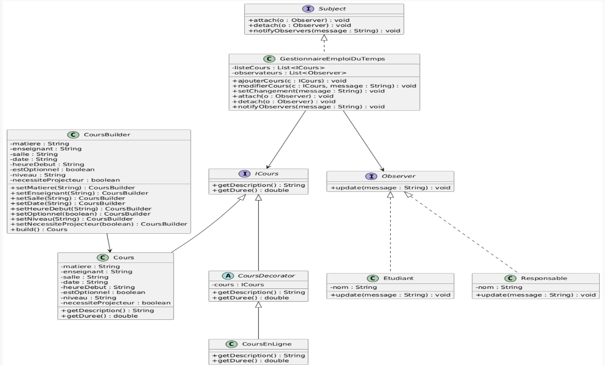

Respect des principes SOLID

Le code respecte globalement les principes SOLID, grâce à l’utilisation d’interfaces, de décorateurs, du pattern Builder et du pattern Observer.
➡️ L’architecture reste modulaire, extensible et bien structurée.

